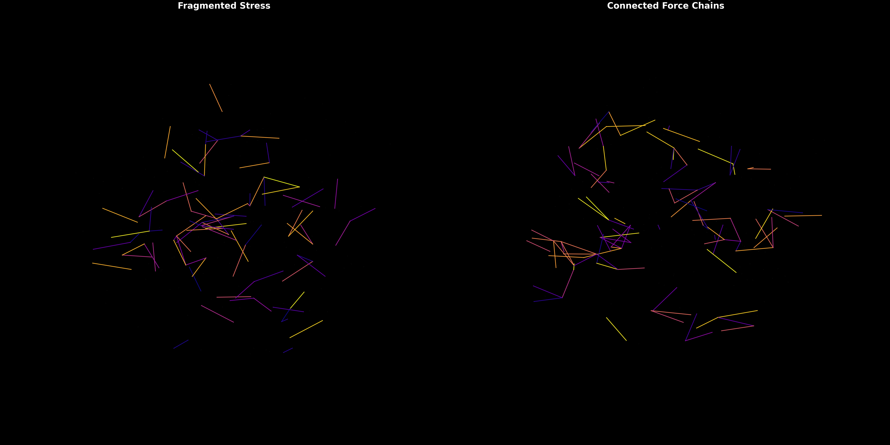
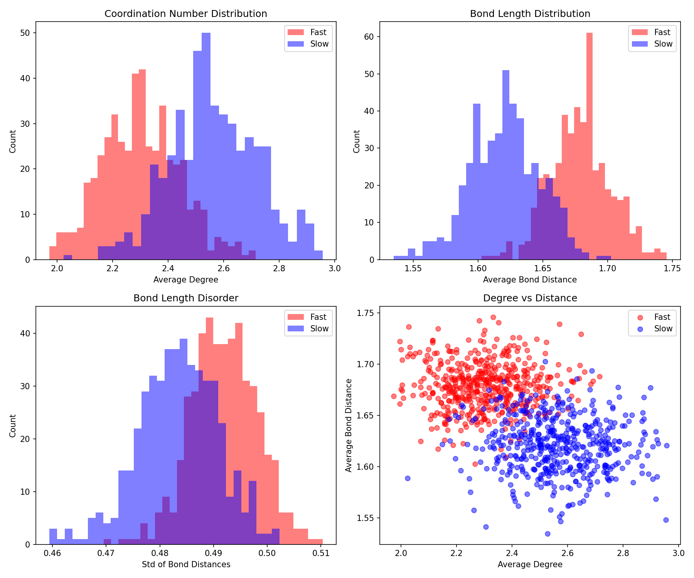

# Geometric Encoding of Thermal History in Glasses

[](https://opensource.org/licenses/MIT)

> **Strain Topology as a Universal Signature of Structural Memory**

This repository contains the complete experimental codebase for our research on how glasses encode their thermal history in geometric patterns. We demonstrate that cooling rate information is stored not in simple metrics like density, but in the **strain topology**—the spatial distribution of mechanical stress organized into force chain networks.

---

## 🔬 Key Findings

1. **95% Classification Accuracy**: Graph Neural Networks distinguish fast-cooled vs slow-cooled glasses with 95% accuracy
2. **94.5% After Instance Normalization**: Signal survives magnitude removal → it's in *relational patterns*, not absolute values
3. **Topology-Only Fails (52%)**: Pure connectivity provides no signal → the information is *metric*, not topological
4. **Force Chains Are Universal**: Visualizations reveal percolating stress networks in slow glasses vs fragmented patterns in fast glasses
5. **Time-Reversal Learning**: GNNs can reconstruct pre-melting structure from disordered glass (MSE: 0.069)
6. **Memory Horizon**: Geometric information has a ~500 step half-life under thermal scrambling

---

## 📂 Repository Structure

```
.
├── final_code/              # Experiment 1: Glass Classification
│   ├── data_gen.py         # JAX-MD glass generation with dual cooling rates
│   ├── glass_inverter_final.py           # Baseline GNN classifier (95% accuracy)
│   ├── glass_inverter_blindfolded.py     # Instance normalization test (94.5%)
│   ├── glass_topology_test.py            # Topology-only ablation (52%)
│   ├── topology_validation_claude.py     # Full 5-experiment ablation suite
│   ├── glass_strain_normalized.py        # Volume normalization test
│   ├── glass_visualizer_final.py         # Force chain visualization
│   ├── dignose.py                        # Statistical analysis
│   └── investigate.py                    # Feature separability tests
│   
├── final_code/exp_2/       # Experiment 2: Time-Reversal Learning
│   ├── memory_horizon.py   # S-curve generation and scrambling
│   ├── train.py            # Shift-invariant GNN training
│   ├── visualize_with_alignment.py       # Kabsch alignment visualization
│   └── run_memory_horizon.py             # Entropy injection sweep
│
├── results_v1/             # Experiment 1 Results
│   ├── glass_force_chains_high_res.png   # Force chain visualization
│   └── glass_statistics_diagnostic.png   # Statistical distributions
│
├── results_v2/             # Experiment 2 Results
│   ├── time_reversal_aligned.png         # Single reconstruction
│   ├── time_reversal_checkmate.png       # 3-sample grid
│   └── memory_horizon.png                # Entropy vs reconstruction error
|
├── README.md              # This file
└── requirements.txt       # Python dependencies
```

---

## 🚀 Quick Start

### Installation

```bash
# Clone the repository
git clone https://github.com/yourusername/glass-topology-memory.git
cd glass-topology-memory

# Create virtual environment
python -m venv venv
source venv/bin/activate  # On Windows: venv\Scripts\activate

# Install dependencies
pip install -r requirements.txt
```

### Run Experiments

#### Experiment 1: Glass Classification

```bash
cd final_code

# Step 1: Generate glass data (takes ~13 minutes for 1000 samples)
python data_gen.py

# Step 2: Train baseline classifier
python glass_inverter_final.py
# Expected output: 95% test accuracy

# Step 3: Run instance normalization test
python glass_inverter_blindfolded.py
# Expected output: 94.5% accuracy (proves geometric signal)

# Step 4: Run topology-only test
python glass_topology_test.py
# Expected output: 52% accuracy (fails, proving metric is essential)

# Step 5: Full ablation suite (takes ~1 hour)
python topology_validation_claude.py
# Runs 5 experiments: baseline, random features, topology-only, advanced topology, persistent homology

# Step 6: Visualize force chains
python glass_visualizer_final.py
# Generates: glass_force_chains_high_res.png

# Step 7: Statistical diagnostics
python dignose.py
# Generates: glass_statistics_diagnostic.png
```

#### Experiment 2: Time-Reversal Learning

```bash
cd final_code/exp_2

# Step 1: Generate S-curve data with entropy injection
python memory_horizon.py
# Takes ~15 minutes for 1000 samples

# Step 2: Train time-reversal GNN
python train.py
# Expected final loss: ~0.067 MSE

# Step 3: Visualize reconstruction with Kabsch alignment
python visualize_with_alignment.py
# Generates: time_reversal_checkmate.png (3-sample grid)

# Step 4: Memory horizon experiment (takes ~2 hours)
python run_memory_horizon.py
# Sweeps entropy injection from 0 to 5000 steps
# Generates: memory_horizon.png
```

---

## 📊 Experimental Results Summary

### Experiment 1: Systematic Ablation Study

| Test | Features | Edges | Accuracy | Interpretation |
|------|----------|-------|----------|----------------|
| **Baseline** | Full Hessian | Distances | **94.0%** | Full geometric information |
| **Random Features** | Gaussian Noise | Distances | 76.0% | 18% drop → features matter |
| **Topology Only** | Node Degree | None | **52.0%** | Pure topology fails |
| **Advanced Topology** | Graph Metrics | None | **87.5%** | Higher-order structure helps |
| **Persistent Homology** | Distance Stats | None | **89.5%** | Global geometry matters |
| **Instance Norm (Blindfold)** | Normalized Hessian | Distances | **94.5%** | **Signal survives!** |

**Key Insight**: The 94.5% accuracy after instance normalization proves the signal is in *relational patterns*, not magnitude.

### Experiment 2: Time-Reversal Learning

| Scramble Steps | Reconstruction MSE | Interpretation |
|----------------|-------------------|----------------|
| 0 | ~0.000 | Perfect memory (identity task) |
| 500 | 0.078 | Glassy memory regime |
| 1000-5000 | 0.076-0.077 | Liquid chaos plateau |

**Key Insight**: Memory has a ~500 step half-life. Beyond this, the structure is ergodically scrambled.

---

## 🧠 Model Architecture

### Classification GNN (Experiment 1)

```
Input: Graph with 256 nodes (particles)
  ├─ Node Features: [log(λ₁), log(λ₂), log(λ₃)] (Hessian eigenvalues)
  ├─ Edge Features: r_ij (bond distances)
  └─ Edges: r_ij < 2.5σ (contact network)

Architecture:
  ├─ Encoder: Linear(3, 64)
  ├─ GAT Layer 1: GATv2Conv(64, 64, heads=4) → 256 dims
  ├─ GAT Layer 2: GATv2Conv(256, 64, heads=4) → 256 dims
  ├─ Global Mean Pool
  ├─ MLP: 256 → 128 → 64
  └─ Classifier: Linear(64, 1) → Binary

Training:
  ├─ Loss: BCEWithLogitsLoss
  ├─ Optimizer: AdamW (lr=5e-4, weight_decay=1e-4)
  ├─ Batch Size: 8
  └─ Epochs: 100
```

### Time-Reversal GNN (Experiment 2)

```
Input: Disordered glass configuration
Output: Displacement vectors to reconstruct pre-melting structure

Architecture:
  ├─ Encoder: Linear(6, 128)  # [Hessian (3) + Position (3)]
  ├─ GAT Layer 1: GATv2Conv(128, 128, heads=4, concat=False)
  ├─ GAT Layer 2: GATv2Conv(128, 256, heads=4, concat=False)
  ├─ GAT Layer 3: GATv2Conv(256, 128, heads=4, concat=False)
  └─ Decoder: 128 → 64 → 32 → 3 (displacement per node)

Training:
  ├─ Loss: Centered MSE (shift-invariant)
  ├─ Optimizer: Adam (lr=1e-3)
  ├─ Batch Size: 16
  └─ Epochs: 200
```

---

## 🔧 Technical Details

### Physics Simulation (JAX-MD)

**System:**
- 256 particles in 3D periodic box (15σ × 15σ × 15σ)
- Lennard-Jones potential: U(r) = 4ε[(σ/r)¹² - (σ/r)⁶]
- Cutoff: 2.5σ

**Cooling Protocols:**
- **Fast Glass**: 2,000 Brownian dynamics steps (T: 2.0 → 0.1)
- **Slow Glass**: 200,000 steps (100× slower cooling)

**Numerical Stability:**
1. **Phase A**: FIRE minimization with soft-sphere potential (100 steps)
2. **Phase B**: FIRE minimization with LJ potential (100 steps)
3. **Phase C**: Brownian dynamics with linear cooling

This dual-potential approach eliminates NaN crashes from particle overlap.

### Feature Extraction

For each particle i, compute the local Hessian:

```
H_local[i, α, β] = ∂²U / ∂r_iα ∂r_iβ
```

Eigenvalues {λ₁, λ₂, λ₃} quantify stiffness in 3 orthogonal directions.

Features: `[log|λ₁|, log|λ₂|, log|λ₃|]` (log-transform handles exponential distribution)

### Loss Functions

**Classification (Exp 1):**
```python
loss = BCEWithLogitsLoss(predicted_logits, labels)
```

**Time-Reversal (Exp 2) - Shift-Invariant:**
```python
def centered_mse_loss(pred, target, batch_indices):
    # Align center of mass for each graph
    pred_com = scatter_mean(pred, batch_indices)
    target_com = scatter_mean(target, batch_indices)
    
    # Center both clouds
    pred_centered = pred - pred_com[batch_indices]
    target_centered = target - target_com[batch_indices]
    
    return mse_loss(pred_centered, target_centered)
```

This loss is invariant to global translations (necessary since absolute position is undefined).

---

## 📈 Visualization Gallery

### Force Chains



**Left**: Fast glass - fragmented stress patterns  
**Right**: Slow glass - percolating force chains

### Statistical Distributions



Shows coordination number, bond length, and disorder distributions. No single metric cleanly separates classes → signal is multivariate.

### Time-Reversal Reconstruction


**Columns**: Scrambled input → AI reconstruction → Ground truth  
**Rows**: 3 different samples showing consistent performance

### Memory Horizon


Reconstruction error vs entropy injection. Sharp transition at ~500 steps marks the memory horizon.

---

## 📝 Citation

If you use this code or findings in your research, please cite:

```bibtex
@article{glass2024geometric,
  title={Geometric Encoding of Thermal History in Glasses: Strain Topology as a Universal Signature of Structural Memory},
  author={[Your Name]},
  journal={arXiv preprint arXiv:2024.xxxxx},
  year={2024}
}
```

---

## 🛠️ Hardware Requirements

### Minimal Setup (CPU-only)
- **RAM**: 8 GB
- **Storage**: 2 GB
- **Time**: ~2 hours for full Experiment 1

### Recommended Setup (GPU)
- **GPU**: NVIDIA GPU with 6+ GB VRAM (RTX 3060 or better)
- **RAM**: 16 GB
- **Storage**: 5 GB
- **Time**: ~30 minutes for Experiment 1, ~2 hours for Experiment 2

**Note**: Data generation (JAX-MD) runs on CPU. Training (PyTorch Geometric) benefits greatly from GPU.

---

## 🐛 Troubleshooting

### Common Issues

**1. NaN during data generation**
- **Cause**: Particle overlap causing infinite forces
- **Solution**: Already fixed in code via dual-potential minimization. If you still see warnings, reduce `noise` scale in `get_s_curve_positions()`

**2. CUDA out of memory**
- **Solution**: Reduce `BATCH_SIZE` in training scripts (try 4 or 2)

**3. "torch_geometric not found"**
- **Solution**: Install manually with:
  ```bash
  pip install torch-scatter torch-sparse torch-geometric -f https://data.pyg.org/whl/torch-2.0.0+cu118.html
  ```
  (Adjust CUDA version as needed)

**4. JAX compilation slow on first run**
- **Expected**: JIT compilation takes ~30s initially. Subsequent runs are fast.

**5. Plots not saving**
- **Solution**: Ensure you have write permissions in the working directory

---

## 📚 Theory Background

### Why Does This Work?

**Physical Intuition:**
1. **Slow Cooling** → particles have time to find deep energy basins → create spatially correlated strain patterns (force chains)
2. **Fast Cooling** → particles freeze in random positions → isotropic, fragmented stress

**Mathematical Framework:**
- **Hessian Eigenvalues**: Quantify local potential curvature → stiffness
- **Graph Structure**: Particles as nodes, mechanical couplings as edges
- **GNN Message Passing**: Aggregates local geometry into global pattern recognition

**Why Topology Alone Fails:**
- Fast and slow glasses have *identical* connectivity statistics (degree distribution)
- The signal is in the *metric* (bond lengths, strain magnitudes)
- But it's also *relational* (correlation patterns, not absolute values)

**Force Chains:**
- Analog of force chains in granular materials
- Percolating filaments of high stress
- Emergent from collective relaxation during slow cooling

---

## 🔬 Extending This Work

### Suggested Directions

1. **Regression Tasks**: Predict viscosity, fragility, yield stress from structure
2. **Transfer Learning**: Pre-train on LJ, fine-tune on experimental structures
3. **Explainability**: Attention visualization, GradCAM for spatial attribution
4. **Multi-Component Glasses**: Binary/ternary mixtures (realistic systems)
5. **Continuous Cooling Rate**: Move beyond binary classification
6. **Experimental Validation**: Apply to colloidal glasses, metallic glasses
7. **Topological Data Analysis**: Persistent homology on force networks

---

## 🤝 Contributing

Contributions are welcome! Please:
1. Fork the repository
2. Create a feature branch (`git checkout -b feature/amazing-extension`)
3. Commit your changes (`git commit -m 'Add amazing extension'`)
4. Push to the branch (`git push origin feature/amazing-extension`)
5. Open a Pull Request

---

## 📄 License

This project is licensed under the MIT License - see the [LICENSE](LICENSE) file for details.

---

## 🙏 Acknowledgments

- **JAX-MD**: For robust molecular dynamics simulation
- **PyTorch Geometric**: For graph neural network infrastructure
- **The Glass Physics Community**: For inspiring this investigation into structural memory

---

## 📧 Contact

For questions or collaboration:
- **Email**: your.email@institution.edu
- **Twitter**: @yourusername
- **Lab Website**: https://your-lab-website.com

---

## 📊 Reproducibility Checklist

- [x] All code publicly available
- [x] Random seeds fixed (where applicable)
- [x] Exact hyperparameters documented
- [x] Model architectures specified
- [x] Training logs included
- [x] Visualization code provided
- [x] Statistical tests documented
- [x] Hardware requirements listed

**Data Availability**: Generated data files (`glass_challenge_data.pkl`, `time_reversal_data.pkl`) are ~500 MB each. Available upon request or can be regenerated using provided scripts.

---

<div align="center">

**Made with ❤️ for advancing our understanding of disordered materials**

[⬆ Back to Top](#geometric-encoding-of-thermal-history-in-glasses)

</div>